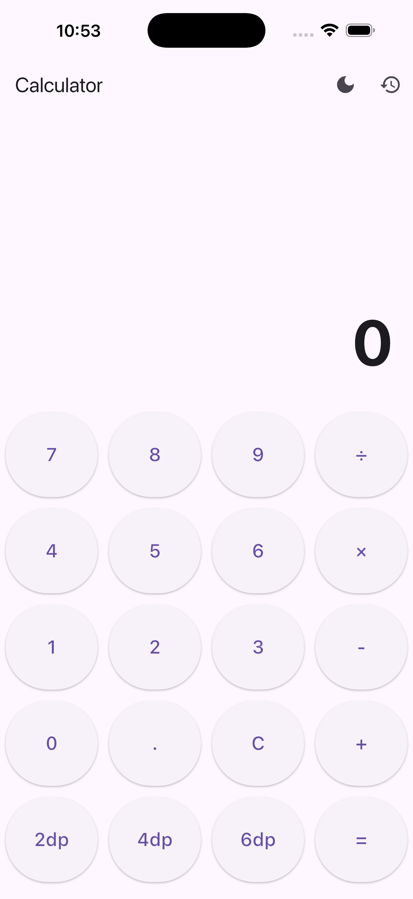
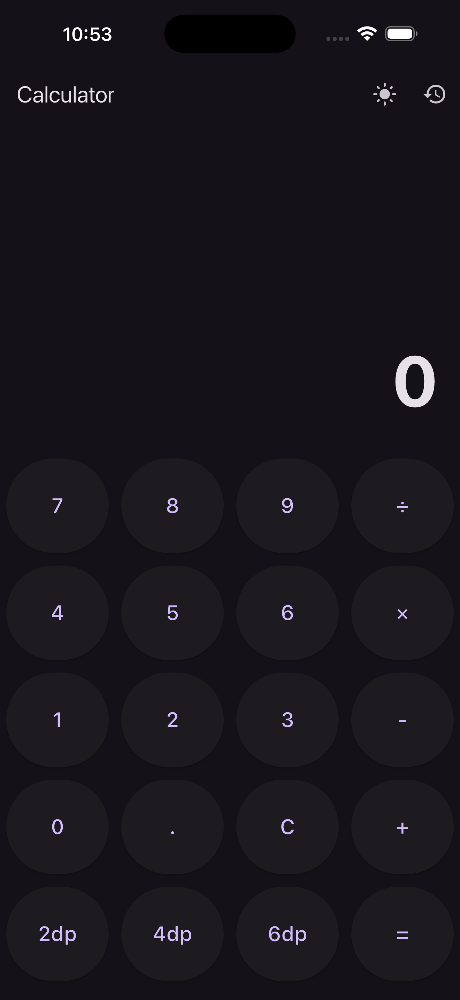
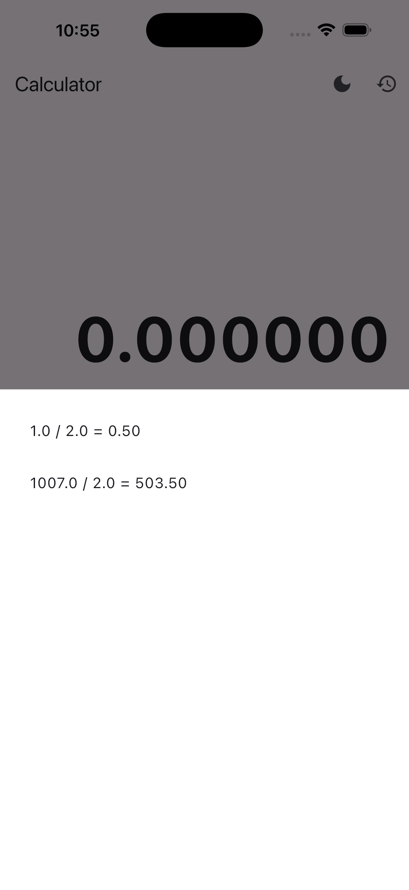
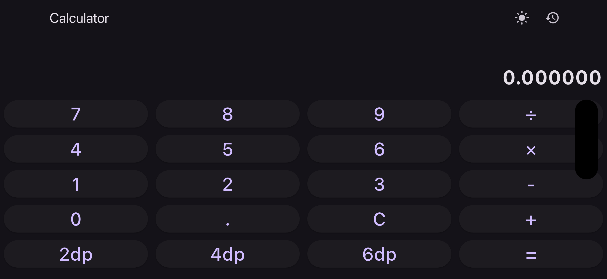

# Calculator App - GetX

Simple calculator app made with Flutter and GetX. Has basic math operations, decimal precision control, history, and theme switching.

## Screenshots

| Light Mode | Dark Mode |
|:---:|:---:|
|  |  |

| History | Landscape |
|:---:|:---:|
|  |  |

*(Note: The actual screenshot files are also attached in the root folder of this project.)*

## What it does

- Basic operations: +, -, ×, ÷
- Chain multiple operations (like 12.5 + 5 × 2)
- Choose decimal places (2, 4, or 6)
- History log in bottom sheet
- Dark/Light mode
- Works in portrait and landscape

## Changing Decimal Precision

There are 3 buttons at the bottom of the calculator - **2dp**, **4dp**, **6dp**. Just tap whichever one you want. It gets saved with GetStorage so it remembers your choice next time.

## Folder Structure

```
lib/
├── main.dart
├── binding/
│   └── calculator_binding.dart
├── controller/
│   └── calculator_controller.dart
└── view/
    └── calculator_screen.dart
```

Binding registers the controller with `Get.lazyPut`, controller has all the logic, view just displays stuff using `Get.find()`.

## Packages

- get
- get_storage

## How to Run

```
flutter pub get
flutter run
```
